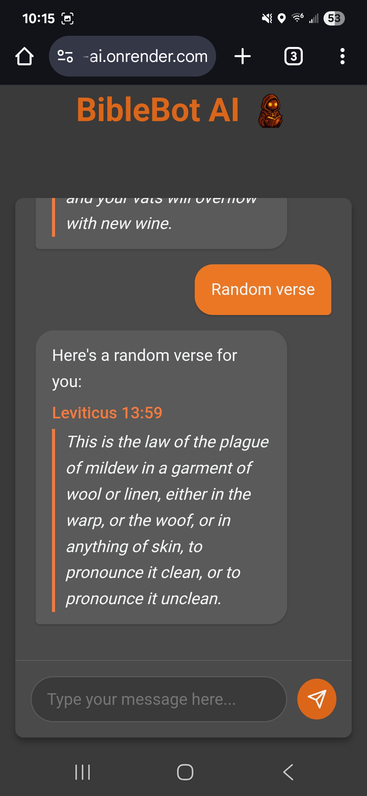

# BibleBot AI

A conversational Progressive Web App (PWA) designed to help you find comfort, guidance, and inspiration in the Holy Scripture.

**[Live Application](https://biblebot-ai.onrender.com/)**

---

*(Note: I recommend taking a screenshot or a short GIF of your app and replacing the link above.)*

## About The Project

BibleBot AI is a friendly and intelligent chatbot that makes exploring the Bible intuitive and accessible. Whether you're looking for a specific verse, seeking encouragement for a particular emotion, or just want a random piece of scripture to reflect on, BibleBot is here to help.

This project was built as a modern Progressive Web App, which means it's fast, reliable, and can be "installed" directly to your phone or computer's home screen for an app-like experience, even working offline.

## Features

*   ** Conversational Interface:** Chat with the bot using natural language.
*   ** Verse of the Day:** Get a curated verse to start your day.
*   ** Emotional Support:** Feeling sad, angry, or anxious? The bot can provide relevant, comforting scriptures.
*   ** Specific Verse Lookup:** Instantly retrieve any verse or passage by its reference (e.g., `John 3:16` or `Ecclesiastes 3:1-8`).
*   ** Random Verse:** Discover a new piece of scripture with the random verse feature.
*   ** PWA Functionality:** Installable on any device (iOS, Android, Desktop) for quick access and offline capabilities.

## Tech Stack

This project is a full-stack application built with a focus on modern web technologies.

### Frontend
*   **HTML5**
*   **CSS3**
*   **Vanilla JavaScript:** For a lightweight and fast user interface.
*   **Service Workers:** To enable PWA features like offline caching and installability.

### Backend
*   **Node.js:** As the JavaScript runtime environment.
*   **Express.js:** For building the robust REST API.
*   **Mongoose:** As the Object Data Modeling (ODM) library for MongoDB.
*   **Natural.js & Sentiment:** For Natural Language Processing (NLP) to understand user intent and emotion.

### Database
*   **MongoDB:** A NoSQL database to store the entire collection of Bible verses.

### Deployment
*   **Render:** For hosting the live application.

## PWA Installation

You can install BibleBot AI on your device for a native app-like experience.

#### On Desktop (Chrome/Edge)
1.  Navigate to the live application URL.
2.  Look for an "Install" icon in the address bar (usually on the right side).
3.  Click it and follow the prompts to add BibleBot to your desktop.

#### On Mobile (iOS/Android)
1.  Open the live application URL in your browser (Safari on iOS, Chrome on Android).
2.  **On iOS:** Tap the "Share" button, scroll down, and select "Add to Home Screen".
3.  **On Android:** Tap the three-dot menu icon and select "Install app" or "Add to Home screen".

## Screenshots

## Author

**Andrew Nicastro**
